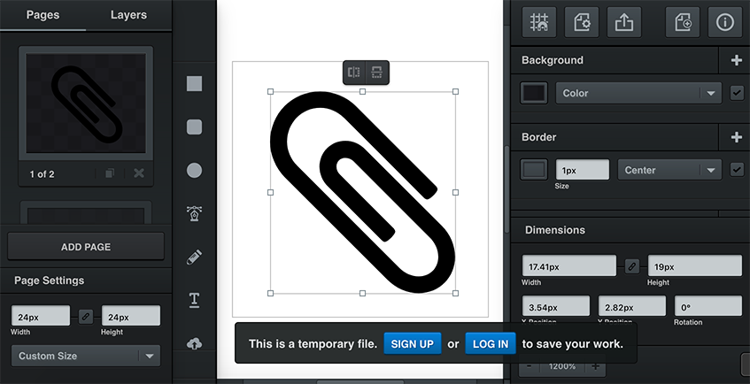

# Joplin TinyMCE Icon Pack

Created from template: https://raw.githubusercontent.com/tinymce/oxide-icon-pack-template

## Adding an icon

- Get it from [Fork Awesome](https://forkaweso.me/)
- Using https://vectr.com/Resize Resize vector graphics to between 15x15 to 20x20 max. Set page dimensions to 24x24 pixels
- Save to src/svg

## Building

Open a terminal and navigate to the project folder, then

1. Install dependencies using `npm install`.
2. Place your icons in `src/svg`
3. Run `gulp` to build the icon pack