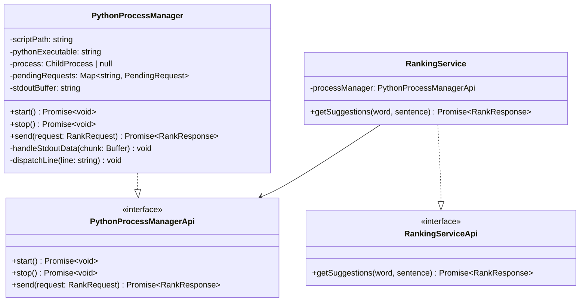

# Thesaurus Plugin — Integration Layer Architecture

```mermaid
classDiagram
    class PythonProcessManagerApi {
        <<interface>>
        +start() Promise~void~
        +stop() Promise~void~
        +send(request: RankRequest) Promise~RankResponse~
    }

    class RankingServiceApi {
        <<interface>>
        +getSuggestions(word, sentence) Promise~RankResponse~
    }

    class PythonProcessManager {
        -scriptPath: string
        -pythonExecutable: string
        -process: ChildProcess | null
        -pendingRequests: Map~string, PendingRequest~
        -stdoutBuffer: string
        +start() Promise~void~
        +stop() Promise~void~
        +send(request: RankRequest) Promise~RankResponse~
        -handleStdoutData(chunk: Buffer) void
        -dispatchLine(line: string) void
    }

    class RankingService {
        -processManager: PythonProcessManagerApi
        +getSuggestions(word, sentence) Promise~RankResponse~
    }

    PythonProcessManager ..|> PythonProcessManagerApi
    RankingService ..|> RankingServiceApi
    RankingService --> PythonProcessManagerApi
```
