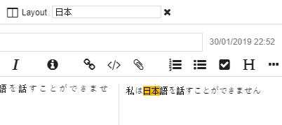

# New search engine in Joplin

The original search engine in Joplin was pretty limited - it would search for your exact query and that is it. For example if you search for "recipe cake" it would return results that contain exactly this word in this order and nothing else - it would not return "apple cake recipe" or "recipe for birthday cake", thus forcing you to try various queries.

The last versions of Joplin include a new search engine that provides much better results, and also allow better specifying search queries.

The search engine indexes in real time the content of the notes, thus it can give back results very fast. It is also built on top of SQLite FTS and thus support [all its queries](https://joplinapp.org/#searching). Unlike the previous search engine, the new one also sorts the results by relevance.

The first iteration of this new search engine was a bit limited when it comes to non-English text. For example, for searching text that contains accents or non-alphabetical characters. So in the last update, better support for this was also added - accentuated and non-accentuated characters are treated in the same way, and languages like Russian, Chinese, Japanese or Korean can be searched easily.

This search engine is still new so it is likely to change over time. For example, ordering the results by relevance is a bit experimental, and some edge cases might not work for non-English language queries. If you notice any issue, feel free to report it on the forum or GitHub. The new search engine is in use in both the mobile and desktop application. 

* * *

url: https://www.patreon.com/posts/new-search-in-24342206
published_at: 2019-01-30T23:02:18.000+00:00