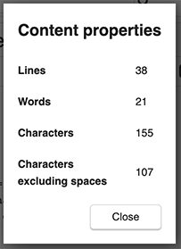

# Large desktop update coming soon

I haven't kept up with releases lately and thus the new one is quite big, it includes 8 new features, 3 security fixes, 19 improvements, and 29 bug fixes. Here's a summary of what to expect:

**Mermaid diagram support**

Mermaid was one of the most requested features, and it is finally here. The diagrams can be inserted using a fenced block, and all the diagrams supported by the library should be available, including Flow, Sequence, Gantt, Class, State and Pie diagrams.

More info in the [Mermaid Markdown documentation](https://joplinapp.org/markdown/#diagrams) 

**Word counter dialog**

A dialog is now available to provide statistics about the current note. It includes line, word and character count:

To open it, click on the post-it toolbar icon.

**Improved tag management**

Also included are several improvement to tags, such as the possibility to add or remove tags from multiple notes, improved sorting of tags in certain contexts, and various other fixes.

**Security fixes**

Joplin having to deal with potentially sensitive data, it is build with privacy and security in mind. We also try to fix any reported security issue as quickly as possible.

This release in particular includes a fix to an XSS vulnerability, which could have allowed an attacker, via a targetted attack and a specially crafted note, to exfiltrate user data. As far as we are aware, this flaw had not been exploited yet.

Finally, the geolocation service on the desktop application was previously using an http service to get the user location. We now use instead an https URL, which will increase privacy.

**Linux**

It is often more difficult to keep up with Linux due to the wide variety of distributions, desktop environments, and the differences between them from one version to the next.

We however try to keep it stable, and regularly get fixes and updates from Linux users. This release includes support for the --no-sandbox flag, required to get the app starting on certain systems, and an optimisation to Nextcloud and WebDAV sync, which could previously be very slow, using persistent connections.

The update is already available as a pre-release [on the GitHub release page](https://github.com/laurent22/joplin/releases/tag/v1.0.187), and should be available as a final release soon.

* * *

url: https://www.patreon.com/posts/large-desktop-34477238
published_at: 2020-03-01T12:50:55.000+00:00