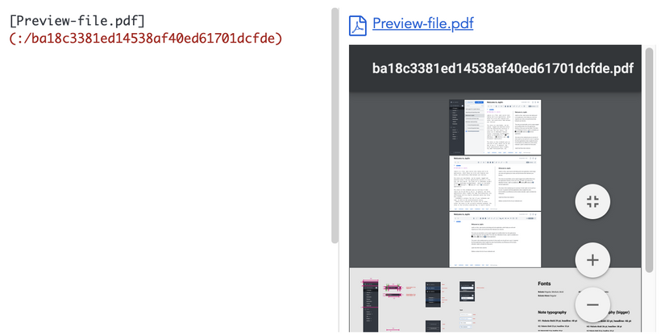

# PDF viewer, audio and video player now in Joplin 1.5

The latest version features of Joplin features a few improvements to make it easier to preview various media files. For now it is possible to view PDF files, as well as listen and view audio and video files.

The feature is optional and you can enable/disable it in the settings, each viewer has its own settings:

For now the feature works on desktop (Markdown editor only) and on mobile (except for the PDF viewer).

* * *

url: https://www.patreon.com/posts/pdf-viewer-audio-45795383
published_at: 2021-01-04T13:16:45.000+00:00