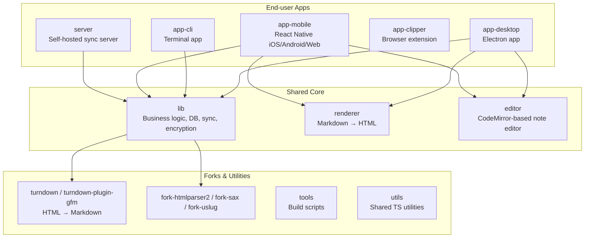

# Project Onboarding Overview

This document is a high-level map of the Joplin codebase aimed at new contributors. It answers two questions: **what is where**, and **how do I run it**.

For deeper detail on building, see [BUILD.md](BUILD.md). For coding conventions, see [coding_style.md](coding_style.md).

---

## Repository layout

The repo is a **Yarn monorepo** managed with Lerna. Everything lives in two top-level folders:

| Folder | Purpose |
| --- | --- |
| `packages/` | All applications and shared libraries |
| `readme/` | All documentation (rendered at joplinapp.org) |

---

## Package map



---

## Key packages at a glance

### End-user applications

| Package | Tech | What it is |
| --- | --- | --- |
| `app-desktop` | Electron + React | The main desktop app for Windows, macOS, and Linux |
| `app-mobile` | React Native | iOS, Android, and experimental web browser target |
| `app-cli` | Node.js | Full-featured terminal client |
| `app-clipper` | Browser extension (MV3) | Saves web pages / screenshots directly into Joplin |
| `server` | Node.js + Koa | Optional self-hosted synchronisation server (Joplin Server / Joplin Cloud backend) |

### Shared libraries (you will touch these most often)

| Package | What it contains |
| --- | --- |
| `lib` | The heart of Joplin. Database models, sync engine, end-to-end encryption, import/export, settings — all shared across every app |
| `renderer` | Converts Markdown notes to HTML. Used by desktop, mobile, and CLI |
| `editor` | CodeMirror 6-based rich Markdown editor used inside desktop and mobile WebViews |

### Supporting packages

| Package | What it contains |
| --- | --- |
| `turndown` / `turndown-plugin-gfm` | Forked HTML-to-Markdown converter |
| `fork-htmlparser2`, `fork-sax`, `fork-uslug` | Forked third-party parsers with Joplin-specific patches |
| `tools` | Gulp build scripts, translation tools, release automation |
| `utils` | Small TypeScript helpers shared across packages |
| `plugins` | Built-in plugins shipped with the desktop app |
| `default-plugins` | Default plugin set bundled at release time |
| `generator-joplin` | Yeoman generator for scaffolding new plugins |
| `onenote-converter` | OneNote → Joplin importer (requires Rust toolchain) |
| `transcribe` / `whisper-voice-typing` | Voice-to-text feature backed by Whisper |

---

## Getting started

### 1. Install dependencies

Install [devbox](https://www.jetify.com/docs/devbox/quickstart/) then run from the repo root:

```sh
devbox shell   # sets up Node, Yarn, and all required tools automatically
yarn install   # installs all workspace packages
```

### 2. Run an app

Pick the surface you want to work on:

```sh
# Desktop (Electron) — most common starting point
cd packages/app-desktop && yarn start

# Terminal / CLI
cd packages/app-cli && yarn start

# Mobile — web preview in browser (no emulator needed)
cd packages/app-mobile && yarn serve-web

# Self-hosted sync server
cd packages/server && yarn start-dev
```

### 3. Watch for TypeScript changes

Most packages are TypeScript. Run this from the repo root to recompile on save:

```sh
yarn watch
```

---

## Where to make a change

| I want to change… | Go to |
| --- | --- |
| Note display / Markdown rendering | `packages/renderer` |
| The editor (typing experience) | `packages/editor` |
| Sync, encryption, database models | `packages/lib` |
| Desktop UI (React components) | `packages/app-desktop` |
| Mobile UI | `packages/app-mobile` |
| CLI commands | `packages/app-cli` |
| Web Clipper behaviour | `packages/app-clipper` |
| Server API / user management | `packages/server` |

> Because `lib` is shared, a change there affects **all** apps. Always verify the other surfaces still work after touching it.

---

## Further reading

- [BUILD.md](BUILD.md) — detailed build instructions per platform
- [coding_style.md](coding_style.md) — code style rules (TypeScript, SCSS, SQL)
- [Contributing guide](../../readme/dev/index.md) — PR workflow and acceptance criteria
