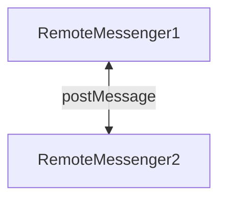
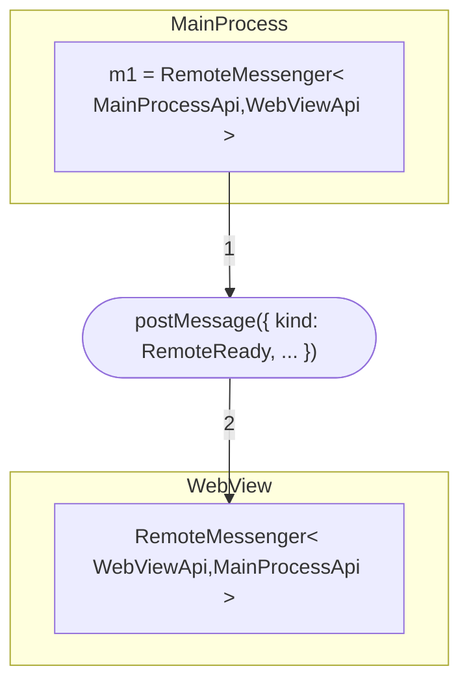
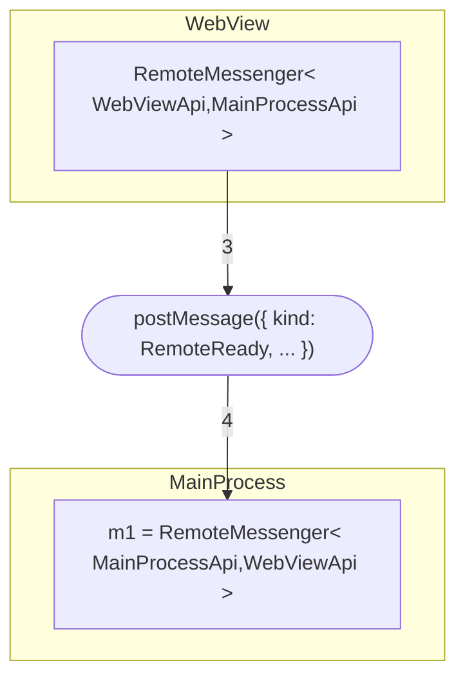
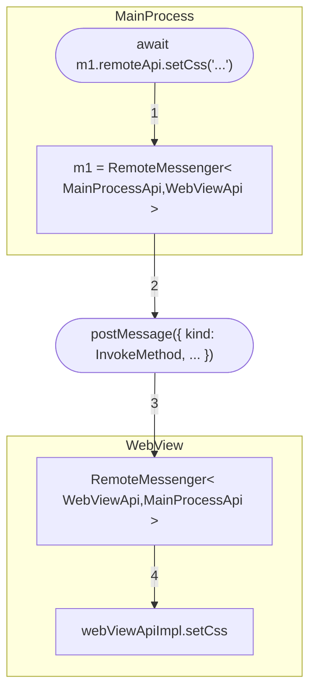
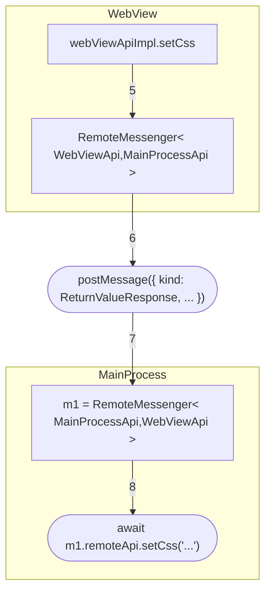
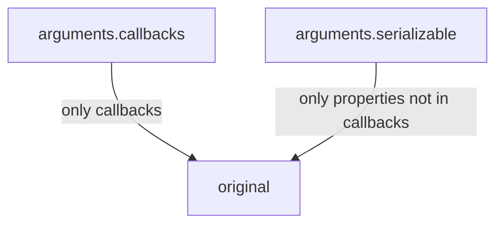

# Plugin system architecture

The plugin system assumes a multi-process architecture, which is safer and easier to manage. For example if a plugin freezes or crashes, it doesn't bring down the app with it. It also makes it easier to find the source of problem when there is one - eg. we know that process X has crashed so the problem is with the plugin running inside. The alternative, to run everything within the same process, would make it very hard to make such a diagnostic. Once a plugin call is frozen in an infinite loop or crashes the app, we can't know anything.

## Main architecture elements

### Plugin script

Written by the user and loaded by Joplin, it's a simple JavaScript file that makes calls to the plugin API. It is loaded in a separate process.

### Sandbox proxy

It is loaded in the same process as the plugin script. Whenever the plugin script calls a plugin API function (eg. joplin.commands.execute) it goes through this proxy. The proxy then converts the call to a plain string and use IPC to send the call to the plugin host. The plugin host executes the function on the plugin API then sends back the result by IPC call again.

### Plugin host

The plugin host is simply the main application. Its role is to start and initialise the plugin service and to load plugins from the provided script files.

### Plugin service

It is used to load and run plugins. Running plugins is platform-specific, thus this part is injected into the service via a platform-specific Plugin Runner.

### Plugin runner

This is the platform-specific way to load and run a plugin. For example, on desktop, it creates a new BrowserWindow (which is a new process), then load the script inside. On Cli, for now the "vm" package is used, so the plugin actually runs within the same process.

The plugin runner also initialises the sandbox proxy and injects it into the plugin code.

### Plugin API

The plugin API is a light wrapper over Joplin's internal functions and services. All the platforms share some of the plugin API but there can also be some differences. For example, the desktop app exposes the text editor component commands, and so this part of the plugin API is available only on desktop. The difference between platforms is implemented using the PlatformImplementation class, which is injected in the plugin service on startup.

## Handling events between the plugin and the host

### On Desktop

Handling events in plugins is relatively complicated due to the need to send IPC messages and the limitations of the IPC protocol, which in particular cannot transfer functions.

For example, let's say we define a command in the plugin:

```typescript
joplin.commands.register({
	name: 'testCommand1',
	label: 'My Test Command 1',
}, {
	onExecute: (args:any) => {
		alert('Testing plugin command 1');
	},
});
```

The "onExecute" event handler needs to be called whenever, for example, a toolbar button associated with this command is clicked. The problem is that it is not possible to send a function via IPC (which can only transfer plain objects), so there has to be a translation layer in between.

The way it is done in Joplin is like so:

In the **sandbox proxy**, the event handlers are converted to string event IDs and the original event handler is stored in a map before being sent to host via IPC. So in the example above, the command would be converted to this plain object:

```typescript
{
	name: 'testCommand1',
	label: 'My Test Command 1',
}, {
	onExecute: '___event_handler_123',
}
```

Then, still in the sandbox proxy, we'll have a map called something like `eventHandlers`, which now will have this content:

```typescript
eventHandlers['___event_handler_123'] = (args:any) => {
	alert('Testing plugin command 1');
}
```

In the **plugin runner** (Host side), all the event IDs are converted to functions again, but instead of performing the action directly, it posts an IPC message back to the sandbox proxy using the provided event ID.

So in the host, the command will now look like this:

```typescript
{
	name: 'testCommand1',
	label: 'My Test Command 1',
}, {
	onExecute: (args:any) => {
		postMessage('pluginMessage', { eventId: '___event_handler_123', args: args });
	};
}
```

At this point, any code in the Joplin application can call the `onExecute` function as normal without having to know about the IPC translation layer.

When the function onExecute is eventually called, the IPC message is sent back to the sandbox proxy, which will decode it and execute it.

So on the **sandbox proxy**, we'll have something like this:

```typescript
window.addEventListener('message', ((event) => {
	const eventId = getEventId(event); // Get back the event ID (implementation might be different)
	const eventArgs = getEventArgs(event); // Get back the args (implementation might be different)
	if (eventId) {
		// And call the event handler
		eventHandlers[eventId](...eventArgs);
	}	
}));
```

### On Mobile

On mobile, not only is the main plugin script running in a separate process, but so are the note editor, renderer, and dialogs.

To simplify communication between these processes, a `RemoteMessenger` class is introduced.

`RemoteMessenger` is `abstract` and independent from how messages are sent. Each type of message channel should have a subclass of `RemoteMessenger` to handle communication over that channel type. For example, `WebViewToRNMessenger` handles communication with React Native from within a React Native WebView. Similarly, `RNToWebViewMessenger` handles communication with a React Native WebView from within React Native.

#### The `RemoteMessenger<LocalInterface, RemoteInterface>` class

The `RemoteMessenger` class simplifies communication over `postMessage`. Its job is to convert asynchronous method calls to messages, then send these messages to another `RemoteMessenger` that handles them.



For example, if we have
```typescript
// Dialogs
export interface MainProcessApi {
	onSubmit: ()=> void;
	onDismiss: ()=> void;
	onError: (message: string)=> Promise<void>;
}

export interface WebViewApi {
	setCss: (css: string)=> void;
	closeDialog: ()=> Promise<void>;
	setButtons: (buttons: ButtonSpec[])=> void;
}
```

We might then create messengers like this:

**In the WebView:**
```typescript
const webViewApiImpl: WebViewApi = {
	// ... some implementation here ...
	setCss: css => {} // ...
};

// Different messageChannelIds allow us to have multiple messengers communicate over the same channel.
// Different IDs prevent the wrong messenger from acting on a message.
const messageChannelId = 'test-channel';

const messenger = new WebViewToRNMessenger<WebViewApi, MainProcessApi>(messageChannelId, webViewApiImpl);
```


**In the main process:**
```typescript
const mainProcessApiImpl: WebViewApi = {
	// ... some implementation here ...
	closeDialog: () => {} // ...
};

const messageChannelId = 'test-channel';
const messenger = new WebViewToRNMessenger<MainProcessApi, WebViewApi>(messageChannelId, mainProcessApiImpl);

// We can now use the messenger.
// Messages are all asynchronous.
await messenger.remoteApi.setCss('* { color: red; }');
```

To call `messenger.remoteApi.setCss(...)`, we use a process similar to the following:

##### First: Queue the method call and wait for both messengers to be ready. 

To avoid sending messages that won't be received (and waiting indefinitely for a response), `RemoteMessenger` buffers messages until it receives a `RemoteReady` event.

When a messenger is ready, it sends a message with `kind: RemoteReady`.


When a messenger receives a message with `kind: RemoteReady`, it replies with the same message type.


##### Second: Send all queued messages

After both messengers are ready, we wend all queued messages. In this case, that's the `setCss` message:
```typescript
{
	kind: MessageType.InvokeMethod,
	methodPath: ['setCss'],
	arguments: {
		serializable: ['* { color: red; }'],

		// If there were callbacks, we would assign them
		// IDs and send the IDs here.
		callbacks: [ null ],
	},
}
```



After handling the message, a result is returned also by `postMessage`, this time with the `kind` `ReturnValueResponse`:



After receiving the response, the `setCss` call resolves.

On mobile, we address the same problem in similar, but more generalized way.  We define a `RemoteMessenger` class that handles `postMessage` communication.

#### `RemoteMessenger` and callbacks

Suppose we call a method in a way similar to the following:
```typescript
messenger.remoteApi.joplin.plugins.register({
	onStart: async () => {
		console.log('testing');
	},
	test: 'test',
});
```

We can't send callbacks over `postMessage`. As such, we assign the `onStart` callback an ID and send the ID instead. The message might look like this:
```typescript
{
	kind: MessageType.InvokeMethod,
	methodPath: ['joplin', 'plugins', 'register'],
	arguments: {
		serializable: [
			{
				onStart: null,
				test: 'test',
			}
		],
		callbacks: [
			{
				onStart: 'some-generated-id-for-onStart',
				test: null,
			}
		],
	},
	respondWithId: 'another-autogenerated-id',
}
```

**Note**: As before, the `respondWithId` connects a method call to its return value (the return value has the same ID).

The `arguments.callbacks` object contains **only** callback IDs and the `arguments.serializable` object contains **only** the serialisable arguments. The two objects otherwise should have the same structure. These two objects are merged by the `RemoteMessenger` that receives the message:



Callbacks are called by sending an `InvokeMethod` message similar to the following:
```typescript
{
	kind: MessageType.InvokeMethod,
	methodPath: ['__callbacks', 'callback-id-here'],
	arguments: { ... },
	respondWithId: 'some-autogenerated-id-here',
}
```
