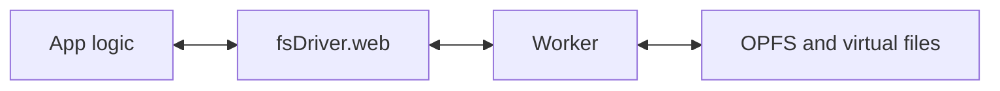
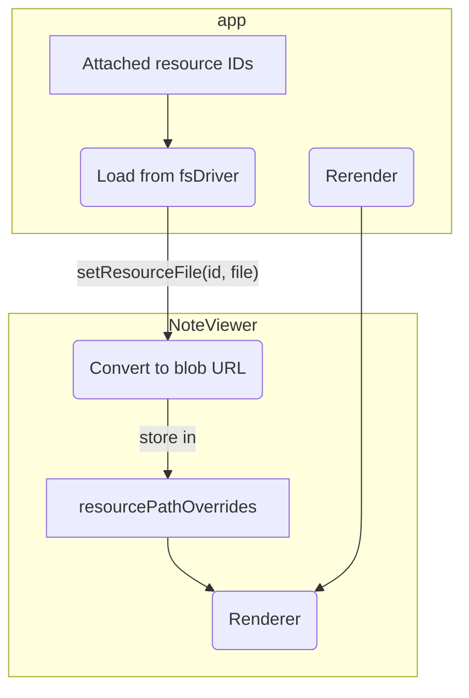

# Web app

:::note

This document explains how the Joplin Web App works from a technical perspective.

:::

The Joplin Web App is a version of the mobile application that targets web using [`react-native-web`](https://www.npmjs.com/package/react-native-web). See [BUILD.md](../BUILD.md#web) for information about building the web app.


## File system

On web, `shim.fsDriver` wraps [the Origin Private File System (OPFS)](https://developer.mozilla.org/en-US/docs/Web/API/File_System_API/Origin_private_file_system). As of July 2024, some major browsers (Safari) only provide the synchronous versions of certain operations (e.g. `createSyncAccessHandle`). These synchronous operations can only be accessed in a web `Worker`.




In addition to files stored persistently through the OPFS API, the web `fsDriver` also supports non-persistent virtual files and access to local user-specified directories.


### Virtual files

In some cases, it doesn't make sense to write temporary files to persistent storage. To support this, `fsDriver.web` supports creating read-only virtual files with `createReadOnlyVirtualFile`. These files are stored in local memory and can be accessed using most `fsDriver` methods.


### Local file access

In some browsers, it's possible to mount local directories using `fsDriver.mountExternalDirectory`. This method takes a handle returned by [`showDirectoryPicker`](https://developer.mozilla.org/en-US/docs/Web/API/Window/showDirectoryPicker), which, as of 2024, has [limited browser support](https://developer.mozilla.org/en-US/docs/Web/API/Window/showDirectoryPicker#browser_compatibility).

To persist access to external directories, file system handles are stored in [an `indexedDB` database](https://developer.mozilla.org/en-US/docs/Web/API/Window/indexedDB), which supports storing and loading file system handles.

External files are mounted as subdirectories of the virtual `/external/` directory.


## Database and cross-origin isolation

The web app uses [`@sqlite.org/sqlite-wasm`](https://github.com/sqlite/sqlite-wasm) for database access.

To function properly (likely due to use of `SharedArrayBuffer`), `@sqlite.org/sqlite-wasm` requires [cross origin isolation to be enabled](https://web.dev/articles/coop-coep). This is done adding certain HTTP headers to responses from the server.

As of July 2024, the official deployment of the Web App is hosted on GitHub pages, [which doesn't support serving with these headers](https://github.com/orgs/community/discussions/13309). The Web App works around this by providing these headers in a `ServiceWorker`.

The Web App's `ServiceWorker` is a heavily-modified fork of [the coi-serviceworker project](https://github.com/gzuidhof/coi-serviceworker), which enables cross-origin isolation.


## Single-instance lock

To prevent data corruption due to out-of-sync state between tabs, the Web App currently only allows one copy of the app to be open at a time.

This single-instance lock is enforced using a `ServiceWorker`. If a user attempts to load the Web App in a new tab, the `ServiceWorker`,
1. determines whether the request is for the Web App (see `handleRedirects` in `serviceWorker.ts`),
2. if so, intercepts the request,
3. checks for an already-running copy of the app, and
4. if a copy of the app is already running, returns an error page.

If the `ServiceWorker` fails to register (and cross-origin isolation is enabled by the server), it may be possible to bypass the `ServiceWorker`'s single-instance lock. As such, a secondary single-instance lock is also present. This lock attempts to communicate with other open Web Apps using a `BroadcastChannel`:
- This might succeed even if the original `ServiceWorker` failed to register.
- This check might incorrectly report that only one app is open if other apps are in a different tab and haven't been used recently.


## Offline support

The `ServiceWorker` intercepts and caches responses to requests for certain file types **from the same domain as the web client**. In the future, when equivalent requests fail, the `ServiceWorker` responds with a cached response.


## WebViews

On all platforms, WebViews that load a local file should use `ExtendedWebView`. This component uses a different WebView implementation on different platforms:
- Android and iOS use `react-native-webview`,
- Jest uses `JSDOM`-based mock, and
- Web uses a sandboxed `iframe`.
   - As of July 2024, `react-native-webview` does not support web.

This section summarizes how `iframe`-based WebViews work on web.


### IPC

High-level communication can be done with `ExtendedWebView` using an `RNToWebViewMessenger` paired with a `WebViewToRNMessenger`. These `RemoteMessenger`s expose methods on JavaScript objects to content inside or outside a `WebView`.

Although `RNToWebViewMessenger` and `WebViewToRNMessenger` wrap `.postMessage` and `.onmessage` with a higher-level API, it's still possible to use the lower-level messaging API.


#### `.postMessage`

For compatibility with `react-native-webview`, `ExtendedWebView` exposes a `ReactNativeWebView` global object to content running within the `WebView`.

For example, the following syntax can be used to send some `message` to the `ExtendedWebView`'s `onMessage` handler.
```js
ReactNativeWebView.postMessage(message) // Calls onMessage
```


#### `window.onmessage`

Message sent to the WebView using `webviewRef.postMessage` are received by the global `onmessage` event. For example,
```tsx
// ...within some component
const webViewRef = useRef<WebViewControl>();

return (
	<ExtendedWebView
		webviewInstanceId='test-webview'
		html={'some html here'}
		injectedJavaScript={`
			window.addEventListener('message', event => {
				if (event.origin === 'react-native') {
					const messageData = event.data;
					// ...use event.data...
				}
			});
		`}
		ref={webViewRef}
		onLoadEnd={() => webViewRef.current.postMessage('test')}
	/>
)
```


## Note viewer

As on Android and iOS, the `NoteBodyViewer` uses an `ExtendedWebView` to render and display notes. However, because the Web App uses a virtual file system, extra processing is needed to transfer resources to the WebView.

For resources, this process might look like this:


A similar process loads plugin assets (e.g. CSS and fonts used by rendered math).


## Incompatible libraries

Some libraries are incompatible with `react-native-web`. There are two or more ways to handle this:
1. Use the library only in an Android and iOS-only file. For example, if the library is used in `shareImage.ts`, create `shareImage.web.ts` with a web-only implementation. On web, the `.web.ts` extension is preferred to the `.ts` extension. On other platforms, this is not the case. As such, on web `shareImage.web.ts` will be imported, while on other platforms `shareImage.ts` will be.
2. Replace the incompatible library with an empty mock (see `web/webpack.config.js`). This can be useful if the library is `imported` by a code that is known to be unreachable on web.
