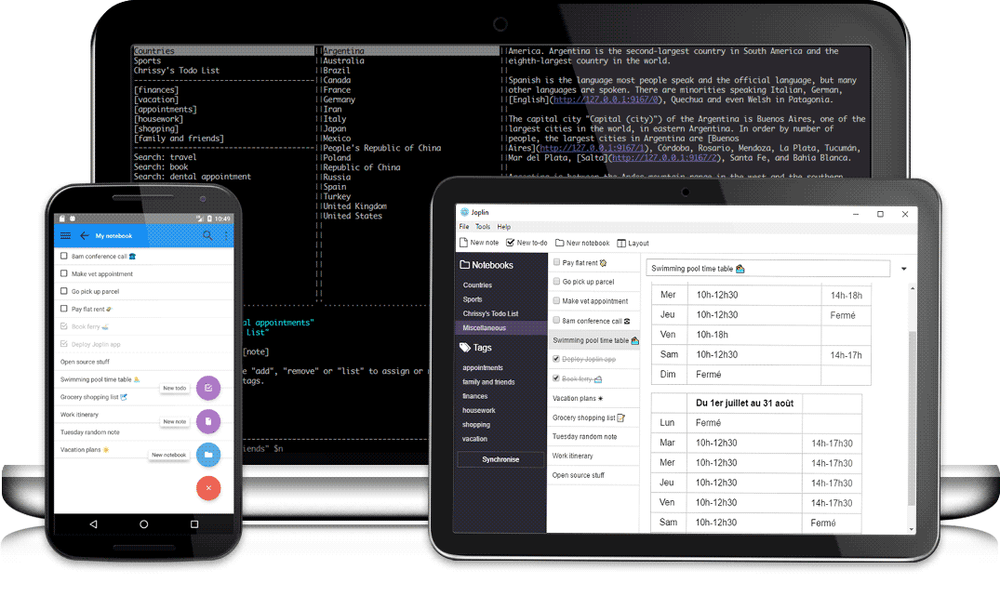
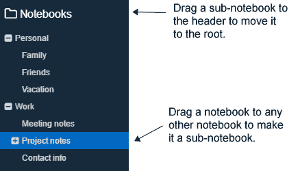

# Welcome to Joplin

Joplin is a free, open source note taking and to-do application, which helps you write and organise your notes, and synchronise them between your devices. The notes are searchable, can be copied, tagged and modified either from the applications directly or from your own text editor. The notes are in [Markdown format](https://joplin.cozic.net/#markdown). Joplin is available as **💻 desktop**, **📱 mobile** and **🔡 terminal** applications.

## Joplin is divided into three parts

Joplin has three main columns:

- **Sidebar**: It contains the list of your notebooks and tags, as well as the synchronisation status.
- **Note List**: It contains the current list of notes - either the notes in the currently selected notebook, or the notes in the currently selected tag.
- **Note Editor**: The note editor contains both an editor panel, where your write your note in Markdown, and a viewer panel, which shows the rendered note. To edit notes, you may also use an [external editor](https://joplin.cozic.net/#external-text-editor). For example, if you like WYSIWYG editors, you can use something like Typora as an external editor and it will display the note as well as any embedded image.

## Writing notes in Markdown

Markdown is a lightweight markup language with plain text formatting syntax. Joplin supports a [Github-flavoured Markdown syntax](https://github.com/adam-p/markdown-here/wiki/Markdown-Cheatsheet) with a few variations and additions.

In general, while Markdown is a markup language, it is meant to be human readable, even without being rendered. This is a simple example (you can see how it looks in the viewer panel):

* * *

# Heading

## Sub-heading

Paragraphs are separated by a blank line. Text attributes _italic_, **bold** and `monospace` are supported. You can create bullet lists:

* apples
* oranges
* pears

Or numbered lists:

1. wash
2. rinse
3. repeat

This is a [link](https://joplin.cozic.net) and, finally, below is an horizontal rule:

* * *

A lot more is possible including adding code samples, math formulas or checkbox lists - see the [Markdown documentation](https://joplin.cozic.net/#markdown) for more information.

## Organising your notes

### With notebooks

Joplin notes are organised into a tree of notebooks and sub-notebooks.

- On **💻 desktop**, you can create a notebook by clicking on New Notebook, then you can drag and drop them into other notebooks to organise them as you wish.
- On **📱 mobile**, press the "+" icon and select "New notebook".
- On **🔡 terminal**, press `:mn`!

### With tags

The second way to organise your notes is using tags:

- On **💻 desktop**, right-click on any note in the Note List, and select "Edit tags". You can then add the tags, separating each one by a comma.
- On **📱 mobile**, open the note and press the "⋮" button and select "Tags".
- On **🔡 terminal**, type `:help tag` for the available commands.