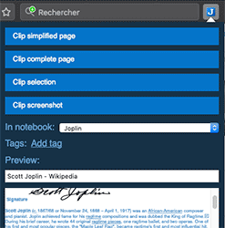

# Tips 💡

The first few notes should have given you an overview of the main functionalities of Joplin, but there's more it can do. See below for some of these features and how to get more help using the app:

## Web clipper

The Web Clipper is a browser extension that allows you to save web pages and screenshots from your browser. To start using it, open the Joplin desktop application, go to the Web Clipper Options and follow the instructions.

More info on the official website: https://joplin.cozic.net/clipper

## Attachments

Any kind of file can be attached to a note. In Markdown, links to these files are represented as an ID. In the note viewer, these files, if they are images, will be displayed or, if they are other files (PDF, text files, etc.) they will be displayed as links. Clicking on this link will open the file in the default application.

Images can be attached either by clicking on "Attach file" or by pasting (with `Ctrl+V` or `Cmd+V`) an image directly in the editor, or by drag and dropping an image.

More info about attachments: https://joplin.cozic.net#attachments--resources

## Search

Joplin supports advanced search queries, which are fully documented on the official website: https://joplin.cozic.net#searching

## Alarms

An alarm can be associated with any to-do. It will be triggered at the given time by displaying a notification. To use this feature, see the documentation: https://joplin.cozic.net#notifications

## Markdown advanced tips

Joplin uses and renders [Github-flavoured Markdown](https://github.com/adam-p/markdown-here/wiki/Markdown-Cheatsheet) with a few variations and additions.

For example, tables are supported:

| Tables        | Are           | Cool  |
| ------------- |:-------------:| -----:|
| col 3 is      | right-aligned | $1600 |
| col 2 is      | centered      |   $12 |
| zebra stripes | are neat      |    $1 |

You can also create lists of checkboxes. These checkboxes can be ticked directly in the viewer, or by adding an "x" inside:

- [ ] Milk
- [ ] Eggs
- [x] Beer

Math expressions can be added using the [KaTeX notation](https://khan.github.io/KaTeX/):

$$
f(x) = \int_{-\infty}^\infty
    \hat f(\xi)\,e^{2 \pi i \xi x}
    \,d\xi
$$

And graphs can be added using the [Mermaid syntax](https://mermaidjs.github.io/):

Various other tricks are possible, such as using HTML, or customising the CSS. See the Markdown documentation for more info - https://joplin.cozic.net#markdown

## Community and further help

- For general discussion about Joplin, user support, software development questions, and to discuss new features, go to the [Joplin Forum](https://discourse.joplin.cozic.net/). It is possible to login with your GitHub account.
- The latest news are posted [on the Patreon page](https://www.patreon.com/joplin).
- For bug reports and feature requests, go to the [GitHub Issue Tracker](https://joplin.cozic.net/issues).

## Donations

Donations to Joplin support the development of the project. Developing quality applications mostly takes time, but there are also some expenses, such as digital certificates to sign the applications, app store fees, hosting, etc. Most of all, your donation will make it possible to keep up the current development standard.

Please see the [donation page](https://joplin.cozic.net/donate/) for information on how to support the development of Joplin.